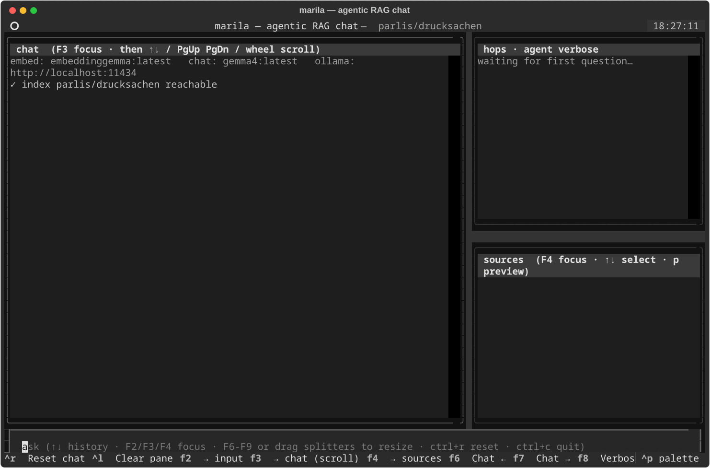
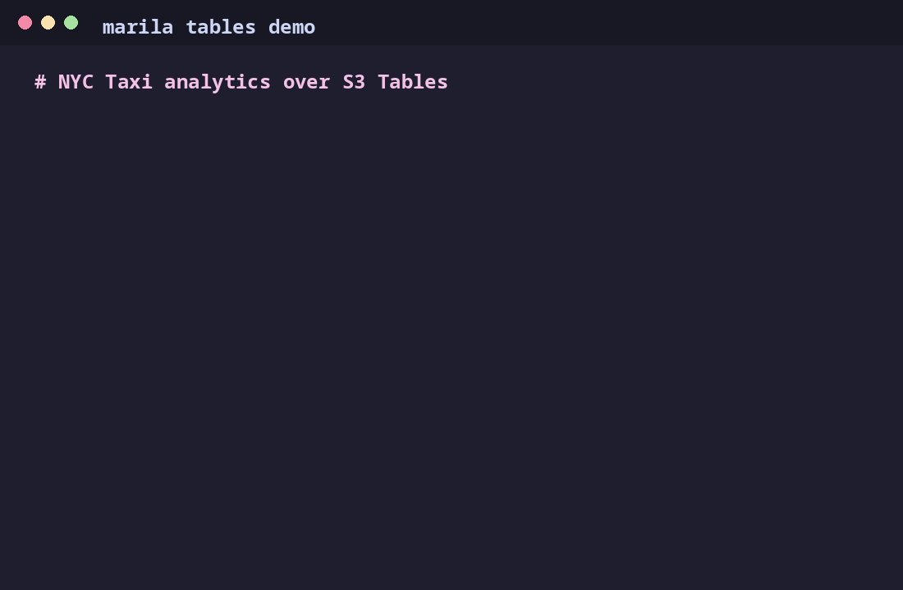
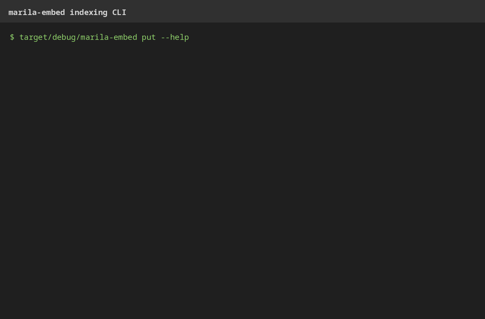

# marila

marila is a local compatibility layer for the AWS S3 Tables and AWS S3
Vectors APIs.

It exposes AWS-shaped HTTP endpoints that client SDKs can target with
`endpoint_url`, while storing data in a local stack:

- RustFS for S3-compatible object storage
- Lakekeeper for Apache Iceberg catalog semantics on the tables side
- DuckDB for local vector state, search, and metadata filtering

marila is pre-1.0 software intended for local development, integration
testing, demos, and compatibility experiments. It is not production
hardened.

## Demos First

The demos are the fastest way to see what marila is for:

- **Vectors:** agentic RAG over a local PDF corpus through the
  S3 Vectors-compatible API.
- **Tables:** NYC Yellow Taxi pivot analytics through the
  S3 Tables-compatible API and Iceberg REST.
- **Indexing CLI:** `marila-embed` parses local documents, chunks text,
  embeds it, and writes vectors with AWS-aligned `put` and `query`
  commands.







The demo clients do not use private Rust hooks or in-process shortcuts.
They are built with `boto3` / `botocore` and point normal AWS SDK clients
at `endpoint_url=http://localhost:8080`:

- `demo/vector/` uses a boto3 `s3vectors` client for vector buckets,
  indexes, puts, and queries.
- `demo/tables/` uses a boto3 `s3tables` client for the table control
  plane, then DuckDB's Iceberg REST support for table data access.
- `marila-embed` uses the AWS Rust SDK `s3vectors` client, so indexing
  talks to marila exactly like any external AWS client would.

The GIFs above are captured from the real Textual demo layouts with
representative S3 Vectors / S3 Tables events. VHS tape scripts for the
matching command-line walkthroughs live in `demo/vhs/`:

```bash
vhs demo/vhs/vector.tape
vhs demo/vhs/tables.tape
vhs demo/vhs/embed-cli.tape
```

See [demo/README.md](demo/README.md) for full setup and walkthroughs.

## Features

- `s3vectors`-style buckets, indexes, vector upsert/query/list/get/delete,
  and MongoDB-style metadata filters.
- `s3tables`-style table buckets, namespaces, tables, metadata-location
  lookup, and an Iceberg REST pass-through at `/iceberg/v1/...`.
- `marila-embed`, a CLI for parsing local documents, chunking text,
  embedding through local or remote providers, and writing to the vectors
  API.
- End-to-end integration tests using AWS Rust SDK clients.

Unsupported AWS operations return explicit `501 NotImplementedException`
responses instead of silently pretending to work.

## Prerequisites

- Rust 1.95.0. The pinned toolchain is in `rust-toolchain.toml`.
- Docker Compose for the RustFS and Lakekeeper sidecars.
- Linux build tools used by transitive dependencies:

```bash
sudo apt-get update
sudo apt-get install -y cmake pkg-config protobuf-compiler
```

The Rust workspace uses a bundled DuckDB build so a system `libduckdb`
package is not required.

## Quick Start

Start the vectors-only stack:

```bash
docker compose up -d rustfs
cargo run -p marila
```

In another shell, run the integration tests:

```bash
cargo test -p marila-integration-tests
```

For the full tables stack:

```bash
docker compose --profile lakekeeper up -d
cargo run -p marila
```

The service listens on `127.0.0.1:8080` by default. Runtime settings can
be overridden with environment variables; see `.env.example`.

## Development Checks

These are the same checks enforced by GitHub Actions:

```bash
cargo fmt --check
cargo clippy --workspace --all-targets -- -D warnings
cargo test --workspace --no-fail-fast
```

The first clean build is large because the workspace compiles DuckDB,
RustFS test support, and AWS SDK clients.

Real AWS contract tests are skipped by default. To opt in, configure AWS
credentials and run with `MARILA_RUN_AWS_CONTRACTS=1`.

## Binary Builds

GitHub Actions builds release archives for Linux x86_64, macOS arm64,
and Windows x86_64 on version tags (`v*`) and manual workflow runs. Each
archive contains the `marila` server binary, the `marila-embed` indexing
CLI, `README.md`, and `LICENSE`.

## Security Model

marila is local-first compatibility software:

- SigV4 headers are parsed but signatures are not verified.
- IAM, bucket policies, encryption policy enforcement, and per-request
  scoped credentials are not implemented.
- Compose credentials are development defaults.

Do not expose a default marila deployment to untrusted networks. See
[SECURITY.md](SECURITY.md) for reporting and security scope.

## Documentation

- [doc/REQUIREMENTS.md](doc/REQUIREMENTS.md): scope and quality goals
- [doc/ARCHITECTURE.md](doc/ARCHITECTURE.md): system design
- [doc/GAP_ANALYSIS.md](doc/GAP_ANALYSIS.md): known AWS semantic gaps
- [doc/DISCOVERIES.md](doc/DISCOVERIES.md): implementation notes and
  compatibility discoveries
- [doc/EMBED_CLI_SPEC.md](doc/EMBED_CLI_SPEC.md): `marila-embed` design

## License

Licensed under the Apache License, Version 2.0. See [LICENSE](LICENSE).
